  

<h3><code>refael@github ~ $ ./links.sh</code></h3>

 

## 🚀 `ls ~/projects`

> 🟢 Released or complete &nbsp;·&nbsp; 🟡 In development &nbsp;·&nbsp; 🔵 Public showcase of a private codebase

### 📈 Trading Systems

| | Project | What it does | Stack |
| :-: | :-- | :-- | :-- |
| 🟡 | [**Gold_BOT_Alaret**](https://github.com/www8351/Gold_BOT_Alaret) | XAUUSD Quarterly-Theory engine. Deterministic core for quarters, HTF bias, SMC, volume profile and risk, routed to Telegram, a dashboard and MT5. **143 tests.** Live orders built but off by default | `Python` |
| 🟡 | [**Account_Guardian_V2**](https://github.com/www8351/Account_Guardian_V2) | Expert Advisor that watches cumulative daily loss across the whole account and locks it, persisted so a restart cannot clear it early. Earlier work: [V1](https://github.com/www8351/Account_Guardian-V1) · [Release](https://github.com/www8351/AccountGuardian-Release) | `MQL5` |

### 🌐 Full-Stack SaaS

| | Project | What it does | Stack |
| :-: | :-- | :-- | :-- |
| 🔵 | [**Vertex_Command_Showcase**](https://github.com/www8351/Vertex_Command_Showcase) | Trade-execution and copy-trading platform. Copy engine, risk engines, live broker WebSockets, Stripe billing, WebGL control center. 26 pages, 55 server modules | `TS` `Python` |
| 🟡 | [**Syncer_Q**](https://github.com/www8351/Syncer_Q) | The same platform in deployment shape. Vercel SPA plus a single-VPS Docker Compose backend, Nginx WAF and TLS. 45 Postgres tables | `TS` `Python` |
| 🔵 | [**Trades_Journal**](https://github.com/www8351/Trades_Journal) | Trading journal that rebuilds every trade from raw executions with exact decimal math. Next.js 16, Supabase RLS. **48 tests** | `TS` |
| 🟢 | [**Tradezella-Example**](https://github.com/www8351/Tradezella-Example) | The journal as a full build record. Crypto, MT4/MT5, futures and equities import, analytics dashboard, deployed on Vercel. **48 tests** | `TS` |

### 🛠️ DevOps & Systems

| | Project | What it does | Stack |
| :-: | :-- | :-- | :-- |
| 🟢 | [**Docker-DevOps-Tooling**](https://github.com/www8351/Docker-DevOps-Tooling) | `dockerctl` typed CLI with a read-only, non-root, cap-dropped compose stack. Trivy gate, SBOMs, cosign-signed multi-arch images. **v0.2.1, 45 tests, 100% coverage** | `Python` |
| 🟢 | [**Linux-Hardening-and-System**](https://github.com/www8351/Linux-Hardening-and-System) | `ossys` turns shell-injection admin scripts into a safe, testable CLI. Plugin system and a closed-by-default tool server. **206 tests, 82% coverage** | `Python` |
| 🟢 | [**Build-Test-Deploy**](https://github.com/www8351/Build-Test-Deploy) | DevOps lab from interactive menus to a Jenkins pipeline. 6 build jobs plus 8 security and cloud jobs. **40 tests at 93% + 16 bats** | `Python` `Shell` |
| 🟢 | [**5-DevOps-Toolkit**](https://github.com/www8351/5-DevOps-Toolkit) | Single-purpose Linux, Docker and AWS tools on one shared engine, each with `--help`, dry-run and root guards. **53 tests, 5 green CI checks** | `Shell` `Python` |

### 🧰 Tools & Teaching

| | Project | What it does | Stack |
| :-: | :-- | :-- | :-- |
| 🟢 | [**Python-Mentoring-Labs**](https://github.com/www8351/Python-Mentoring-Labs-for-Junior-Engineers) | Seven labs taking a junior from `input()` scripts to pure, typed, tested functions. Each lab pairs with the real beginner bug it replaced | `Python` |
| 🟢 | [**Claude_Quota_Line**](https://github.com/www8351/Claude_Quota_Line) | Two-line terminal status line showing context window, 5-hour and weekly usage limits | `PowerShell` |

🔒 Two private repositories: <b>Vertex_Command</b>, the production codebase behind the showcases, and <b>The-Binary-Ledger</b>, a Knesset voting-transparency index.

 

## 🧪 `./run-tests --all`

| 🧪 Project | Tests | Coverage | Gate |
| :-- | :-: | :-: | :-- |
| Linux-Hardening-and-System | **206** | 82% | mypy strict |
| Gold_BOT_Alaret | **143** | | pytest |
| 5-DevOps-Toolkit | **53** | | bats + pytest, 5 CI checks |
| Trades_Journal · Tradezella | **48** | | vitest |
| Docker-DevOps-Tooling | **45** | **100%** | mypy strict, Trivy |
| Build-Test-Deploy | **40 + 16** | 93% | pytest + bats |

 

## 🛠️ `cat stack.txt`

| | |
| :-- | :-- |
| 💬 **Languages** |       |
| 🌐 **Frontend & SaaS** |       |
| ⚙️ **Backend & Realtime** |       |
| ☁️ **DevOps & Cloud** |       |
| 🔭 **Observability** |     |
| 🛡️ **Security** | Trivy · CycloneDX SBOM · cosign · gitleaks · UFW and SSH hardening · Cilium · Falco |
| ✅ **Quality** | pytest · vitest · bats · mypy strict · ruff · coverage gates · TDD |
| 📈 **Trading** | MetaTrader 5 API · TwelveData · Tradovate · TopstepX · Rithmic |

 

## 🎯 `man refael`

| | Principle | In practice |
| :-: | :-- | :-- |
| 🧱 | **Pure core** | Logic stays free of I/O, so it runs without a broker, a socket or a VM |
| 🔐 | **Security first** | `.env.example` only, credentials encrypted at rest, real-money paths off by default |
| 🧪 | **Verifiable** | Strict typing, coverage-gated suites, CI that blocks every push |
| 📝 | **Honest docs** | Each README says what the build does not do yet |

 

## 🇮🇱 בקצרה בעברית

מהנדס מערכות שבונה תוכנה ברמת ייצור בשלושה תחומים שנדיר למצוא יחד: מערכות מסחר אלגוריתמי, פלטפורמות ווב מלאות, ותשתיות ענן מאובטחות.
כל פרויקט כאן כולל בדיקות אוטומטיות, אבטחה כברירת מחדל, ותיעוד כן שאומר מה עובד היום ומה עוד לא.

 

<i>"No filler. Clean architecture and deterministic performance."</i>

<code>refael@github ~ $ exit</code>

